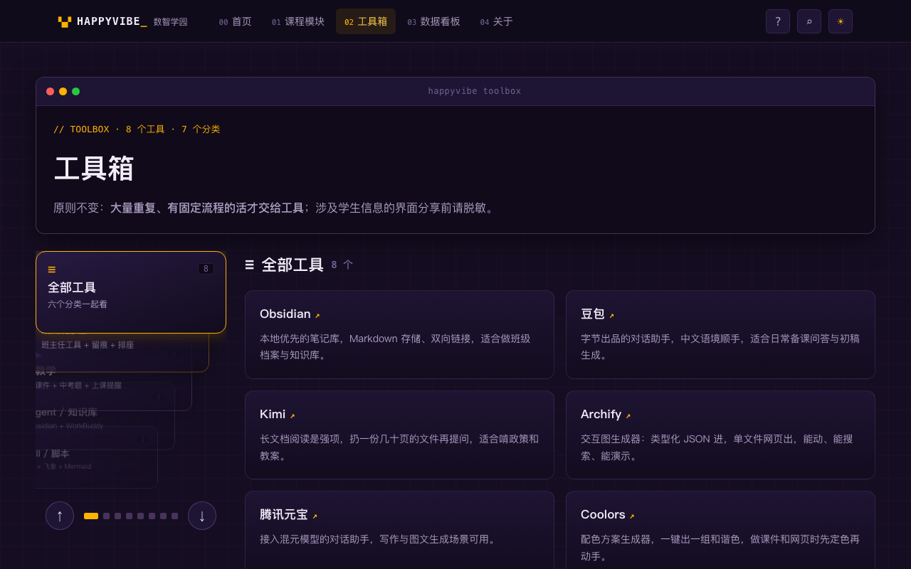
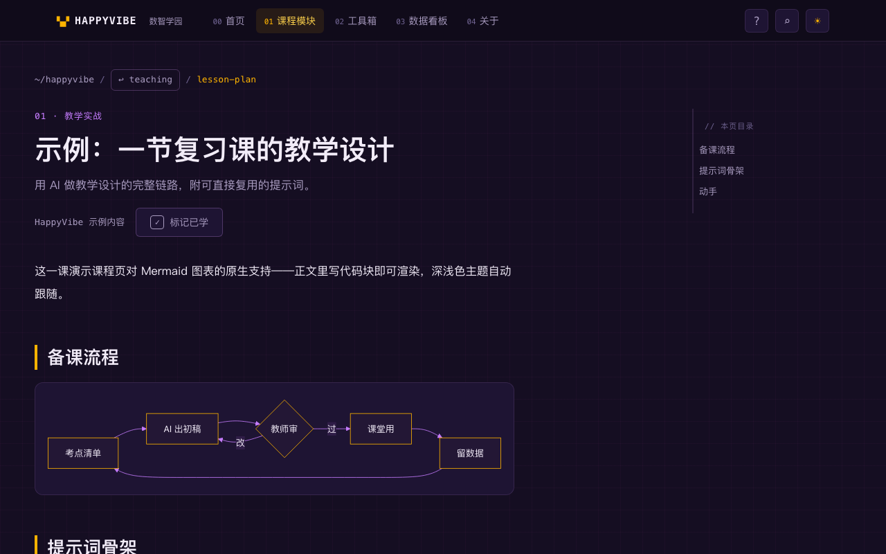
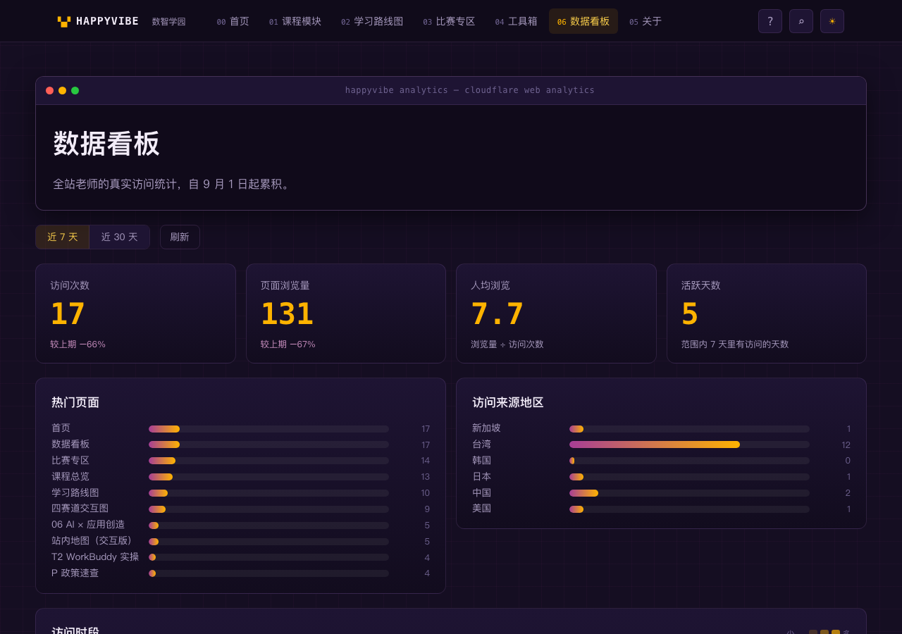
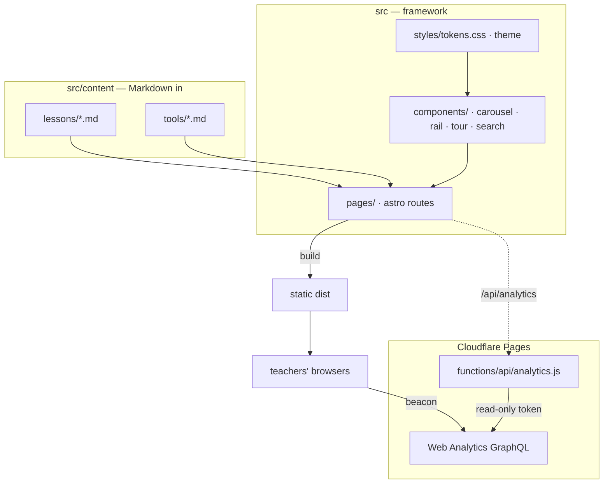

<div align="center">

▚▞ **HAPPYVIBE**

# HappyVibe for Teachers

An open-source learning-site framework for teachers.

Astro · Zero-dependency UI · Cloudflare Web Analytics · CC BY 4.0

[](https://creativecommons.org/licenses/by/4.0/)
[](https://astro.build)
[](https://github.com/PIGU-PPPgu/happyvibe/pulls)

**[在线演示 Live Demo](https://happyvibe.intelliedu.cc)** · **[中文说明](#中文说明)**

</div>


---

## Screenshots

| Toolbox — sidebar rail & filter | Lesson — native Mermaid | Analytics — site-wide stats |
|---|---|---|
|  |  |  |

HappyVibe grew out of a real teacher-training site for a school group in China — a place where teachers learn to work with AI, from writing their first prompt to shipping their first teaching tool. This repository is the framework underneath: a complete learning site you can fill with your own content by writing Markdown.

## What's inside

| Feature | Notes |
|---|---|
| Course system | Content collections with modules & lessons; write a `.md` file, it's a lesson |
| Toolbox | Categorized, searchable tool directory — also driven by Markdown |
| Zero-dependency UI | Stacked-card carousel, sidebar rail with drag, search modal, onboarding spotlight tour — all vanilla, no JS framework |
| Local progress | "Mark as learned" stored in the visitor's own browser; no accounts, no tracking |
| Site-wide search | Pagefind index built at deploy time; ⌘K anywhere |
| Analytics dashboard | `/analytics/` page wired to Cloudflare Web Analytics through a Pages Function; token stays server-side |
| Mermaid support | Write a ` ```mermaid ` block in any lesson; light/dark themes both handled |
| Light / dark theme | CSS variables throughout, persisted preference |
| Auto deploys | Included GitHub Pages workflow (fork & enable), or one-command Cloudflare Pages deploy |

## Architecture



## Quick start

```bash
git clone https://github.com/PIGU-PPPgu/happyvibe.git
cd happyvibe
npm install
npm run dev        # http://localhost:4321
```

## Write your first lesson

Lessons live in `src/content/lessons/<module>/<lesson>.md`:

```markdown
---
title: 发出你的第一句话
module: start          # a slug from src/data/modules.ts
order: 2
description: 一句话课程简介，显示在课程卡上。
source: 你的署名
status: ready          # draft | ready
minutes: 15
---

正文就是课堂内容，Markdown 全支持。


```

Register a new module in `src/data/modules.ts` (slug, code, title, accent color, learning mode). The carousel, module pages, prev/next navigation and sitemap pick it up automatically.

Tools work the same way: one file per tool in `src/content/tools/`, with a category and an optional external URL.

## Enable the analytics dashboard

The `/analytics/` page reads site-wide stats from Cloudflare Web Analytics via a Pages Function (so the API token never ships to browsers).

1. In the Cloudflare dashboard, open **Web Analytics** and confirm your site is measured (a beacon is auto-injected on Cloudflare Pages).
2. Create a read-only API token at **My Profile → API Tokens → Create Token → Custom**: permission `Account → Account Analytics → Read`.
3. Set the secrets on your Pages project:

```bash
npx wrangler pages secret put CF_ANALYTICS_TOKEN --project-name=<your-project>
npx wrangler pages secret put CF_ACCOUNT_ID   --project-name=<your-project>   # your Cloudflare account ID
# optional, defaults to happyvibe.intelliedu.cc
npx wrangler pages secret put CF_ANALYTICS_HOST --project-name=<your-project>
```

> Note: the analytics API is a Cloudflare Pages Function, so it only runs when deployed on Cloudflare Pages. On GitHub Pages hosting, `/analytics/` shows a friendly "unconfigured" note — everything else works.

## Deploy

**Cloudflare Pages (recommended — analytics included):**

```bash
npm run build
npx wrangler pages deploy dist --project-name=<your-project>
```

**GitHub Pages (fork & flip a switch):** the included `.github/workflows/deploy.yml` builds and publishes on every push to `main`. Enable **Settings → Pages → Source: GitHub Actions**.

## License & attribution

Code and content are licensed under [CC BY 4.0](https://creativecommons.org/licenses/by/4.0/). You are free to use, modify and redistribute this project, including commercially, **as long as you credit the source**. Suggested attribution:

> Based on HappyVibe for Teachers by 吴林璋 (Pigou Workshop) · https://happyvibe.intelliedu.cc

## Credits

- [Archify](https://github.com/tt-a1i/archify) — interactive diagram generator used for the original site's knowledge maps (MIT)
- [Astro](https://astro.build) · [Pagefind](https://pagefind.app) · [Cloudflare Pages](https://pages.cloudflare.com)

---

## 中文说明

**HappyVibe for Teachers** 是一个给老师用的开源学习站框架，从一个真实的集团教师 AI 培训站里长出来。课程、工具箱、全站搜索、本地进度、新手引导、数据看板一应俱全，全部零依赖原生实现——写 Markdown 就是写课程，一条命令部署到 Cloudflare Pages。

- 在线演示：https://happyvibe.intelliedu.cc （真实运行中的培训站）
- 快速开始：`npm install && npm run dev`
- 加一节课：往 `src/content/lessons/<模块>/` 放一个带 frontmatter 的 Markdown，模块在 `src/data/modules.ts` 里注册
- 数据看板：三个环境变量（只读 Token、账号 ID、站点域名）即可点亮，Token 只存在服务端
- 协议：CC BY 4.0，可自由使用与修改，**必须注明出处**

