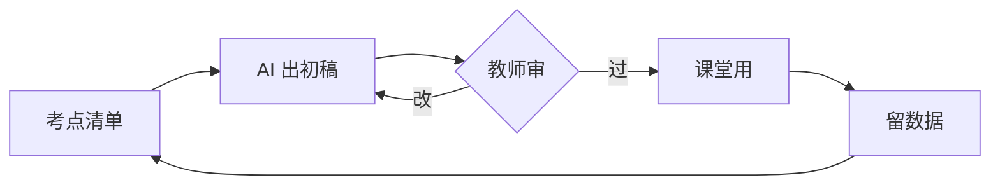

这一课演示课程页对 Mermaid 图表的原生支持——正文里写代码块即可渲染，深浅色主题自动跟随。

## 备课流程

## 提示词骨架

> 你是初中数学老师，正在准备初三「二次函数」复习课（45 分钟）。
> 班级情况：基础中等，动手意愿弱，上次月考该章节平均得分率 62%。
> 请给出教学设计：导入 5 分钟 + 两个例题 + 一个课堂练习 + 小结。
> 每个例题标注它针对的易错点。输出用表格。

## 动手

换一个你本周真的要上的章节，把班级情况换成真的，跑一遍。
